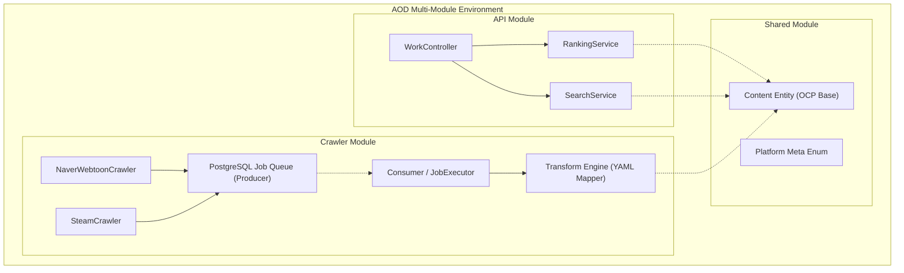

# AOD (All of Dopamine) - Project Overview for AI Agents

## 1. 개요 (Introduction)
- **프로젝트 명:** AOD (미디어컨텐츠 종합 정보 및 AI 큐레이션 서비스)
- **목적:** 영화, OTT, 게임, 웹툰, 웹소설 등 다양한 도메인과 N개의 플랫폼(Steam, TMDB, Naver 등) 정보를 한 번에 수집하고 종합하여 랭킹 및 AI 맞춤 추천을 제공합니다.
- **핵심 아키텍처 철학:** 
  1. **개방-폐쇄 원칙(OCP):** 플랫폼이나 도메인이 추가되더라도 핵심 엔티티와 비즈니스 소스코드를 수정하지 않도록 설계.
  2. **독립성(Multi-Module):** `api`(REST 서빙), `crawler`(수집 파이프라인), `shared`(공통 엔티티 및 DB 레포지토리)의 3-Tier 멀티모듈로 완벽히 분리.

## 2. 아키텍처 다이어그램 (컴포넌트 구조)
아래는 모듈 간의 의존성과 데이터 큐(Queue)의 역할을 명확히 보여주는 시스템 구조도입니다.

## 3. 핵심 기술 (Key Technologies)
- **Backend:** Spring Boot 3.x, Spring Data JPA, Java 17
- **Database:** PostgreSQL (GIN Index 적용, SKIP LOCKED 잡 큐)
- **Concurrency Control:** Queue-based Producer-Consumer Pattern
- **DevOps:** Docker (tini 활용 좀비 프로세스 해결), Prometheus + Grafana

*AI Agent 지시사항: 이 프로젝트를 분석할 때, 멀티모듈(`.shared`, `.api`, `.crawler`) 간 참조 경로를 항상 확인하며, 특정 도메인 로직 변경 시 `shared`의 엔티티 구조가 깨지지 않도록 유의해야 합니다.*
