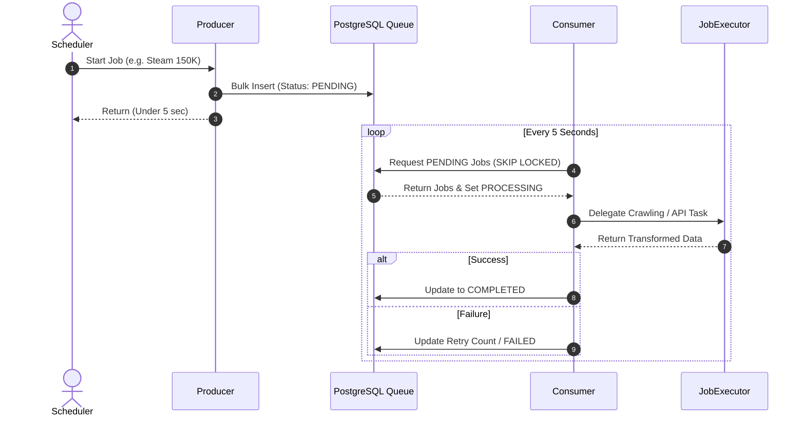

# 동시성 제어: Producer-Consumer 기반 Job Queue 시스템

## 1. 개요
대량의 크롤링 데이터(예: Steam 15만 건)를 처리할 때, 특정 스레드가 오랜 시간 점유되어 다른 도메인 작업(웹툰, 소설 등)이 완전히 블로킹되는 문제를 해결하기 위해 도입된 구조입니다.

## 2. 해결 방법 요약
- **Producer:** 크롤링 대상 ID 목록을 수집하여 즉시(5초 내) PostgreSQL 데이터베이스의 Job Queue용 테이블에 **PENDING** 상태로 Insert 하고 스레드를 반납합니다.
- **PostgreSQL SKIP LOCKED:** 강력한 비관적 락(Pessimistic Lock)과 SKIP LOCKED 키워드를 활용해 락 대기 시간을 0으로 만들며, 다수의 Consumer 인스턴스가 동시 실행되어도 작업 중복을 막습니다.
- **Consumer:** 5초마다 주기적으로 돌아가며 PENDING 작업들을 N개씩 빼오고, 각 플랫폼별 최적화된 배치 사이즈(Selenium: 1건/5초, API: 5건/5초)를 적용하여 처리합니다.

## 3. 시퀀스 다이어그램 (Sequence Diagram)

## 4. AI/개발자 행동 지침 (Guidelines)
- **새로운 플랫폼 개발 시:** Consumer나 DB 접근 코드를 수정할 필요 없이, `JobExecutor` 인터페이스를 상속받은 새 클래스만 구현하면 전략 패턴(Strategy Pattern)에 의해 자동 등록되고 실행됩니다.
- **배치 최적화:** 새로운 크롤러가 너무 느리다면, 해당 `JobExecutor`의 `getBatchSize()` 정책을 조절하여 다른 작업이 지연되지 않도록 관리해야 합니다.
