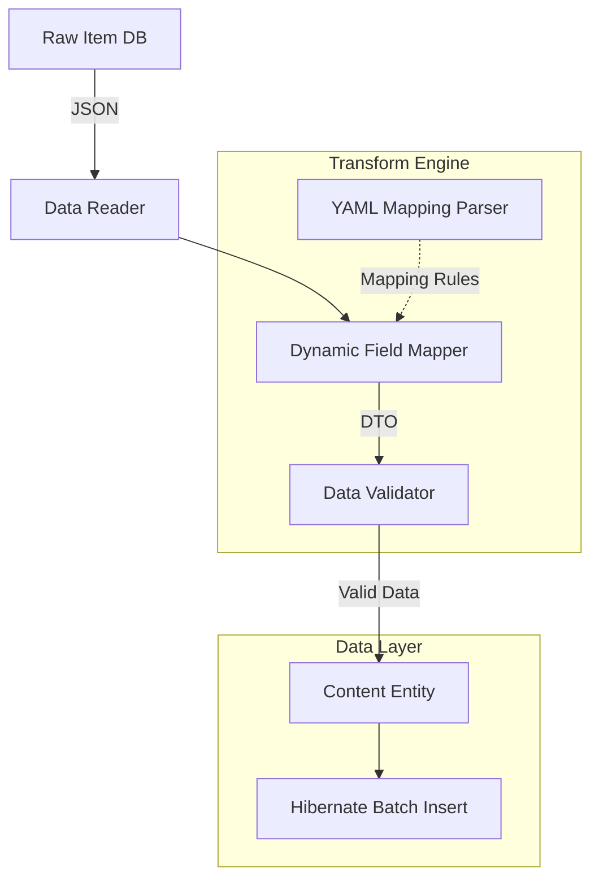

# 유연한 파이프라인: YAML 기반 Transform Engine

## 1. 개요
영화, OTT, 게임 등 다양한 형태의 Raw Data 필드명(appid, rating, viewCount 등)이 존재할 때, 이를 DB(Content Entity)에 삽입하기 위해 Java 코드를 하드코딩하면 새 플랫폼이 생길 때마다 재배포 및 소스코드 수정이 강제됩니다(OCP 위반).
해당 문제는 `resources/rules/*.yml`을 이용한 동적 파서(Transform Engine) 구축으로 유연하게 해결되었습니다.

## 2. 데이터 흐름 프레임워크 (Data Flowchart)

## 3. 핵심 아키텍처 및 강점
- **코드 무수정(Config-only) 확장:** 새로운 플랫폼이 추가되면 `.yml` 파일 규칙만 새로 선언해주면 즉시 데이터 추출 파이프라인이 구동됩니다. (`RuleRegistry`가 기동 시 `classpath:rules/**/*.yml`을 전부 스캔해 yml 안의 `platformName`/`domain`으로 자동 인덱싱 — 과거의 자바 switch 매핑 3중 중복은 제거됨)
- **성능과 속도 보장:** 가공된 10만 건 이상의 데이터를 개별 저장하지 않고 Hibernate Batch Insert 기능을 통해 50개 단위로 트랜잭션을 묶어 삽입합니다. (2.8시간 분량을 단 3분으로 단축)
- **무결성 방어:** 파서를 돌며 값이 NULL이 되거나 타입 캐스팅(String->Integer)이 불가능한 경우 Validator가 데이터를 파기하여 서버의 장애를 예방합니다.

## 4. YML 룰 스키마 (선언 가능한 것들)

| 섹션 | 역할 | 예시 |
|---|---|---|
| `platformName` / `domain` | RuleRegistry 인덱스 키 (필수) | `NaverSeries` / `WEBNOVEL` |
| `fieldMappings` | 원본 경로 → 목적지 라우팅. 목적지 접두사가 저장 위치를 결정: 없음=`contents`(마스터), `domain.`=도메인 테이블, `platform.`=platform_data, `platform.attributes.`=JSONB | `viewCount: platform.attributes.view_count` |
| `defaults` | 원본에 값이 없을 때 채울 명시적 기본값 (key=목적지 경로). 선언 없으면 해당 필드는 스킵 | `platform.attributes.comment_count: 0` |
| `platformsFrom` | `domain.platforms` 배열에 병합할 attributes 키 목록 (예: TMDB OTT 제공자) | `- watch_providers` |
| `domainObjectMappings` | domainDoc 키 → 엔티티 필드 매핑 + 타입 변환(`string`/`integer`/`long`/`date`/`list`) + `valueMap`(원본값 치환표) | `status: {targetField: status, type: string, valueMap: {"true": 완결}}` |
| `normalizers` | 마스터 필드 정규화 파이프 (`nfkc`, `strip_parentheses`, `strip_brackets`, `collapse_spaces`, `strip_series_qualifiers`, `lowercase`) | — |

> **새 플랫폼 추가 절차**: `rules/<domain>/<platform>.yml` 파일 1개 작성이 전부다. 자바 코드 수정 불필요.
> 날짜 문자열은 `FlexibleDateParser`가 한국어/ISO/점·슬래시/영어 표기를 모두 처리한다.
