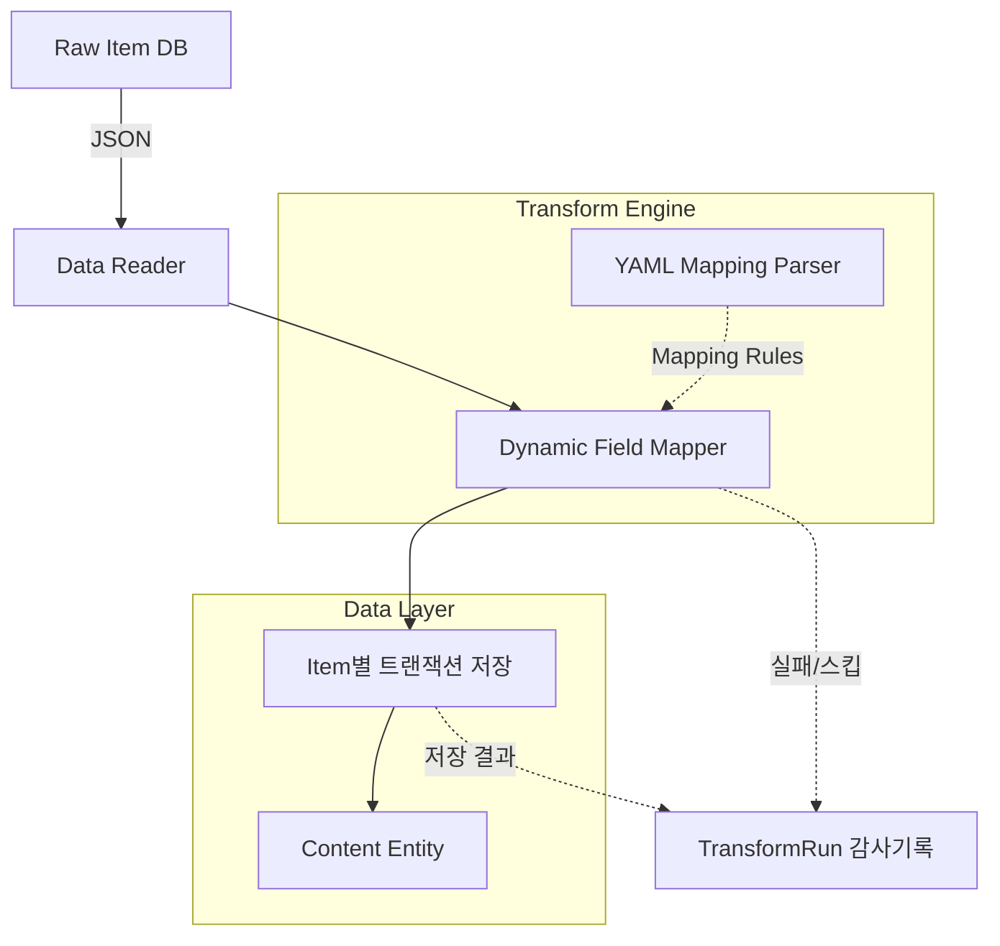

# 유연한 파이프라인: YAML 기반 Transform Engine

## 1. 개요
영화, OTT, 게임 등 다양한 형태의 Raw Data 필드명(appid, rating, viewCount 등)이 존재할 때, 이를 DB(Content Entity)에 삽입하기 위해 Java 코드를 하드코딩하면 새 플랫폼이 생길 때마다 재배포 및 소스코드 수정이 강제됩니다(OCP 위반).
해당 문제는 `resources/rules/*.yml`을 이용한 동적 파서(Transform Engine) 구축으로 유연하게 해결되었습니다.

## 2. 데이터 흐름 프레임워크 (Data Flowchart)

## 3. 핵심 아키텍처 및 강점
- **코드 무수정(Config-only) 확장:** 새로운 플랫폼이 추가되면 `.yml` 파일 규칙만 새로 선언해주면 즉시 데이터 추출 파이프라인이 구동됩니다. (`RuleRegistry`가 기동 시 `classpath:rules/**/*.yml`을 전부 스캔해 yml 안의 `platformName`/`domain`으로 자동 인덱싱 — 과거의 자바 switch 매핑 3중 중복은 제거됨)
- **item별 트랜잭션 격리:** 한 건의 변환 실패가 배치 전체를 롤백하지 않는다. 실패/스킵은 `TransformRun`에 FAILED/SKIPPED로 기록되고 배치는 계속된다 (독약 아이템은 claim 시점에 processed 처리되어 무한 재시도가 차단됨).
- **무결성 방어:** 목적지 프로퍼티 오타·타입 불일치·죽은 설정은 기동 검증(RuleRegistry)이 부팅 실패로 차단하고, 제목 없는 항목은 SKIPPED로 감사 기록된다 — 조용한 데이터 유실 0.

## 4. YML 룰 스키마 v4 (선언 가능한 것들)

| 섹션 | 역할 | 예시 |
|---|---|---|
| `platformName` / `domain` | RuleRegistry 인덱스 키 (필수) | `NaverSeries` / `WEBNOVEL` |
| `mappings` | 원본 경로 → 목적지. 접두사가 저장 위치 결정: `master.*`=contents(프로퍼티명), `domain.*`=도메인 엔티티(프로퍼티명), `platform.*`=platform_data(프로퍼티명), `attr.*`=JSONB 키 리터럴 | `author: domain.author` |
| `defaults` | 원본 누락 시 채울 명시적 기본값 (key=목적지). 선언 없으면 스킵 | `attr.comment_count: 0` |
| `platformsFrom` | `platforms` 배열에 병합할 attr 키 목록 | `- watch_providers` |
| `normalizers` | master 프로퍼티별 정규화 파이프 (`nfkc`, `strip_parentheses`, `strip_brackets`, `collapse_spaces`, `strip_series_qualifiers`, `lowercase`) | `master.masterTitle: [nfkc]` |

> 목적지 프로퍼티명 오타·엔티티 rename 미반영은 **부팅 실패**로 잡힌다 (RuleRegistry 기동 검증). 죽은 defaults(어떤 매핑도 안 쓰는 기본값)와 생산자 없는 platformsFrom 키도 부팅 실패로 잡힌다.
> 구 v3의 `domainObjectMappings`/`valueMap`은 폐지 — 목적지가 프로퍼티명 직결이라 2중 매핑이 불필요.
> 런타임 트레이스는 [8_INGEST_PIPELINE_TRACE.md](8_INGEST_PIPELINE_TRACE.md) 참고(구 엔진 기준 — 갱신 예정).

> **새 플랫폼 추가 절차**: `rules/<domain>/<platform>.yml` 파일 1개 작성이 전부다. 자바 코드 수정 불필요.
> 날짜 문자열은 `FlexibleDateParser`가 한국어/ISO/점·슬래시/영어 표기를 모두 처리한다.
