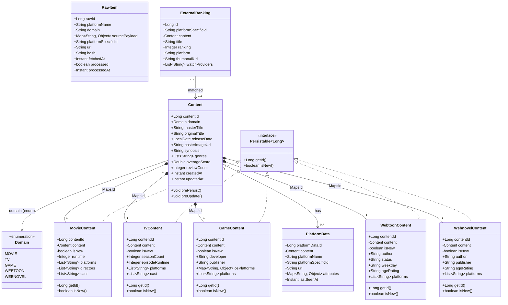

# AOD 백엔드 클래스 다이어그램

> 백엔드(멀티모듈: `shared` 엔티티/리포지토리 · `api` :8080 · `crawler` :8081)의 주요 클래스 구조를 서브시스템별 **Mermaid 클래스 다이어그램**으로 정리한 문서. GitHub/IDE에서 바로 렌더됩니다.
> 다이어그램의 클래스·필드·메서드명은 코드 식별자라 원문(영문)을 유지하고, 설명·주석은 한국어로 작성했습니다. 가독성을 위해 핵심 멤버·관계만 표시합니다(Lombok getter/setter 등 생략).

## 목차

1. [3-Tier 영속성 도메인 모델 (shared 엔티티)](#1-3-tier-영속성-도메인-모델-shared-엔티티)
2. [Shared 모듈 — Spring Data JPA 리포지토리](#2-shared-모듈--spring-data-jpa-리포지토리)
3. [크롤러 Producer-Consumer 작업큐](#3-크롤러-producer-consumer-작업큐)
4. [크롤러 Ingest 파이프라인 (typed, RuleRegistry v4)](#4-크롤러-ingest-파이프라인-typed-ruleregistry-v4)
5. [플랫폼별 크롤러 아키텍처 (Fetcher / Processor / Service + Selenium 인프라)](#5-플랫폼별-크롤러-아키텍처-fetcher--processor--service--selenium-인프라)
6. [API 모듈 (:8080) — Controller → Service → Repository → Entity 계층 + JWT 보안](#6-api-모듈-8080--controller--service--repository--entity-계층--jwt-보안)

---

## 1. 3-Tier 영속성 도메인 모델 (shared 엔티티)

shared 모듈의 JPA 도메인은 Content 마스터 테이블(`contents`, domain/masterTitle/releaseDate 기준)을 중심으로 한 3-tier 설계다. 각 Content 행은 `@OneToOne @MapsId`로 같은 PK를 공유하는 도메인별 상세 행(MovieContent·TvContent·GameContent·WebtoonContent·WebnovelContent) 하나를 소유한다. 모든 자식은 `Persistable~Long~`을 구현하고 `@Transient isNew` 플래그를 가지며, `@PostLoad/@PostPersist`에서 false로 전환해 Hibernate가 `@MapsId` INSERT를 UPDATE로 오판하지 않게 한다. Content는 PlatformData(플랫폼별 URL + JSONB attributes)로 1:N 확장되며, RawItem은 크롤 원본 payload(JSONB)+dedup hash+processed 플래그를 가진 독립 스테이징 테이블, ExternalRanking은 매칭된 Content를 선택적으로 역참조(nullable FK)하는 랭킹 항목이다.

> **참고:** 모든 필드 타입/이름은 소스 기준 검증(임의 추가 없음). 자식은 content_id를 Content와 공유(`@MapsId`)하므로 합성 화살표는 별도 FK가 아닌 공유 PK 1:1 소유를 의미하며, 각 자식은 `content` 역참조 필드도 가진다(가독성 위해 Content 쪽 표기 생략). isNew는 `@Transient`이며 markNotNew()로 false 전환. RawItem.domain은 enum이 아닌 String이고 Content와 연관 없음(순수 스테이징). Persistable은 `org.springframework.data.domain.Persistable`로, 제네릭 표기 위해 `Persistable~Long~`로 렌더. Lombok getter/setter 생략.

---

## 2. Shared 모듈 — Spring Data JPA 리포지토리

shared 모듈은 9개의 Spring Data JPA 리포지토리 인터페이스를 노출하며 모두 `JpaRepository~Entity, Long~`을 상속한다. ContentRepository는 마스터 카탈로그(검색, 신작/출시예정 윈도우, `@Modifying updateRatingInfo` 벌크 업데이트, reviews 테이블과 조인하는 recently-reviewed 네이티브 쿼리)를 담당한다. 5개 도메인 리포지토리(Game/Movie/Tv/Webtoon/Webnovel)는 동일 계약을 공유한다 — GIN 친화 `@>` 플랫폼 필터(findByPlatformsContainingAll)와 통합 findWorks, findByContentIdIn, 그리고 컬럼이 있는 경우 author/developer 조회. 장르 필터/집계(countByGenre/findDistinctGenres)는 genres가 contents로 승격되면서(2026-07) ContentRepository로 이관됐다. PlatformDataRepository는 JSONB로 OTT watch-provider와 distinct 플랫폼명을, RawItemRepository는 `FOR UPDATE SKIP LOCKED`로 동시 배치 점유를, ExternalRankingRepository는 `LEFT JOIN FETCH`로 Content N+1 회피를 수행한다.

```mermaid
classDiagram
%% ===== 베이스 Spring Data 인터페이스 (모든 repo가 상속) =====
class JpaRepository~T, Long~ {
  <<interface>>
  +T save(T)
  +Optional~T~ findById(Long)
  +List~T~ findAll()
  +void deleteById(Long)
}

%% ===== 마스터 카탈로그 리포지토리 =====
class ContentRepository {
  <<interface>>
  +Optional~Content~ findFirstByDomainAndMasterTitleAndReleaseDate(Domain, String, LocalDate)
  +Page~Content~ findByDomain(Domain, Pageable)
  +Page~Content~ findByDomainOrderByReleaseDateDesc(String, LocalDate, Pageable)
  +Page~Content~ searchByDomainAndKeyword(Domain, String, Pageable)
  +Page~Content~ searchByKeyword(String, Pageable)
  +List~Content~ findByContentIdIn(List~Long~)
  +Page~Content~ findRecentReleases(Domain, LocalDate, Pageable)
  +Page~Content~ findUpcomingReleases(Domain, LocalDate, LocalDate, Pageable)
  +Page~Content~ findReleasesInDateRange(Domain, LocalDate, LocalDate, Pageable)
  +Page~Content~ findByDomainAndPlatforms(Domain, List~String~, Pageable)
  +Page~Content~ findByDomainAndKeywordAndPlatforms(Domain, String, List~String~, Pageable)
  +void updateRatingInfo(Long, Double, Integer)
  +Page~Content~ findRecentlyReviewedContentsNative(Pageable)
  +Page~Content~ findRecentlyReviewedContentsByDomainNative(String, Pageable)
  +List~Object[]~ countByGenre(String)
  +List~String~ findDistinctGenres(String)
}

%% ===== 도메인별 콘텐츠 리포지토리 (GIN @> 필터) =====
class GameContentRepository {
  <<interface>>
  +Page~GameContent~ findByPlatformsContainingAll(String[], Pageable)
  +List~GameContent~ findByDeveloper(String)
  +List~GameContent~ findByPublisher(String)
  +List~GameContent~ findByContentIdIn(List~Long~)
}

class MovieContentRepository {
  <<interface>>
  +Page~MovieContent~ findByPlatformsContainingAll(String[], Pageable)
  +List~MovieContent~ findByContentIdIn(List~Long~)
}

class TvContentRepository {
  <<interface>>
  +Page~TvContent~ findByPlatformsContainingAll(String[], Pageable)
  +List~TvContent~ findByContentIdIn(List~Long~)
}

class WebtoonContentRepository {
  <<interface>>
  +Page~WebtoonContent~ findByPlatformsContainingAll(String[], Pageable)
  +List~WebtoonContent~ findByAuthor(String)
  +List~WebtoonContent~ findByContentIdIn(List~Long~)
}

class WebnovelContentRepository {
  <<interface>>
  +Page~WebnovelContent~ findByPlatformsContainingAll(String[], Pageable)
  +List~WebnovelContent~ findByAuthor(String)
  +List~WebnovelContent~ findByContentIdIn(List~Long~)
}

%% ===== 플랫폼 + 스테이징 + 랭킹 리포지토리 =====
class PlatformDataRepository {
  <<interface>>
  +Optional~PlatformData~ findByPlatformNameAndPlatformSpecificId(String, String)
  +List~PlatformData~ findByContent(Content)
  +List~String~ findDistinctPlatformNamesByDomain(Domain)
  +List~String~ findDistinctPlatformNames()
  +List~Long~ findContentIdsByWatchProvider(String)
  +List~Long~ findContentIdsByDomainAndWatchProvider(String, String)
}

class RawItemRepository {
  <<interface>>
  +Optional~RawItem~ findByHash(String)
  +Optional~RawItem~ findByPlatformNameAndPlatformSpecificId(String, String)
  +List~RawItem~ lockNextBatch(int)
  +long countByProcessedFalse()
  +List~RawItem~ findPendingItemsByPlatform(String, int)
}

class ExternalRankingRepository {
  <<interface>>
  +List~ExternalRanking~ findByPlatform(String)
  +Optional~ExternalRanking~ findByPlatformAndPlatformSpecificId(String, String)
  +List~ExternalRanking~ findByPlatformOrdered(String)
  +List~ExternalRanking~ findByPlatformWithContent(String)
  +List~ExternalRanking~ findAllWithContent()
}

%% ===== 실현: 각 repo는 JpaRepository~Entity, Long~ =====
JpaRepository~T, Long~ <|.. ContentRepository : Content
JpaRepository~T, Long~ <|.. GameContentRepository : GameContent
JpaRepository~T, Long~ <|.. MovieContentRepository : MovieContent
JpaRepository~T, Long~ <|.. TvContentRepository : TvContent
JpaRepository~T, Long~ <|.. WebtoonContentRepository : WebtoonContent
JpaRepository~T, Long~ <|.. WebnovelContentRepository : WebnovelContent
JpaRepository~T, Long~ <|.. PlatformDataRepository : PlatformData
JpaRepository~T, Long~ <|.. RawItemRepository : RawItem
JpaRepository~T, Long~ <|.. ExternalRankingRepository : ExternalRanking

%% ===== 주요 repo/엔티티 의존관계 =====
ContentRepository ..> Domain : filters by
PlatformDataRepository ..> Domain : filters by
ExternalRankingRepository ..> Content : JOIN FETCH
```

> **참고:** 네이티브 SQL 핵심: genres는 2026-07 contents로 승격 — 장르 필터/집계(`@>`, UNNEST)는 ContentRepository가 담당하고, 도메인 repo에는 platforms 필터(findByPlatformsContainingAll)와 통합 findWorks만 남음. PlatformDataRepository.findContentIdsByWatchProvider*는 JSONB `attributes->'watch_providers'`를 jsonb_array_elements_text로 조회. RawItemRepository.lockNextBatch는 `FOR UPDATE SKIP LOCKED`로 동시 컨슈머 배치 점유. ContentRepository.findByDomainOrderByReleaseDateDesc와 두 findRecentlyReviewed*는 네이티브(reviews 조인), updateRatingInfo는 `@Modifying` JPQL 벌크 업데이트. 가독성 위해 JpaRepository 기본 CRUD와 비-도메인 오버로드는 생략. ⚠️ RawItemRepository.findPendingItemsByPlatform은 `:limit` 파라미터를 선언하지만 JPQL에서 적용하지 않음.

---

## 3. 크롤러 Producer-Consumer 작업큐

크롤러의 범용 Producer-Consumer 작업큐를 모델링한다. CrawlJob은 JobType·JobStatus와 재시도 정보, markAsProcessing/Completed/Failed 상태전이를 가진 단일 통합 JPA 엔티티(`crawl_job_queue`)다. CrawlJobProducer가 PENDING 작업을 (중복 제거 후) bulk insert하고, CrawlJobConsumer가 10초마다 `@Scheduled` 배치로 폴링하며 JobType별로 SKIP LOCKED(PESSIMISTIC_WRITE + LIMIT) 행을 가져온다. 핵심은 전략 패턴이다 — JobExecutorRegistry가 모든 JobExecutor 빈을 JobType 키 Map으로 자동 수집하고, Consumer는 각 executor에 권장 배치 크기를 물어 실행을 위임하며, 각 구현체는 도메인별 크롤 서비스를 감싼다. 즉 플랫폼 추가 = executor 하나 추가(Consumer 수정 불필요). MasterScheduler는 도메인별 SchedulingService를 통해 대상만 큐에 넣는 별도 cron 계층이다.

```mermaid
classDiagram
    class CrawlJob {
        +Long id
        +JobType jobType
        +String targetId
        +String metadata
        +JobStatus status
        +Integer priority
        +Integer retryCount
        +Integer maxRetries
        +String errorMessage
        +LocalDateTime createdAt
        +LocalDateTime startedAt
        +LocalDateTime completedAt
        +void markAsProcessing()
        +void markAsCompleted()
        +void markAsFailed(String)
        +boolean canRetry()
    }

    class JobStatus {
        <<enumeration>>
        PENDING
        PROCESSING
        COMPLETED
        RETRY
        FAILED
        SKIPPED
    }

    class JobType {
        <<enumeration>>
        STEAM_GAME
        TMDB_MOVIE
        TMDB_TV
        NAVER_WEBTOON
        NAVER_WEBTOON_FINISHED
        NAVER_SERIES_NOVEL
        KAKAO_PAGE_NOVEL
        KAKAO_PAGE_WEBTOON
    }

    class JobExecutor {
        <<interface>>
        +JobType getJobType()
        +boolean execute(String targetId)
        +long getAverageExecutionTime()
        +int getRecommendedBatchSize()
    }

    class SteamGameExecutor {
        -SteamCrawlService steamCrawlService
        +JobType getJobType()
        +boolean execute(String)
        +long getAverageExecutionTime()
    }
    class TmdbMovieExecutor {
        -TmdbService tmdbService
        +JobType getJobType()
        +boolean execute(String)
    }
    class TmdbTvExecutor {
        -TmdbService tmdbService
        +JobType getJobType()
        +boolean execute(String)
    }
    class NaverWebtoonExecutor {
        -NaverWebtoonService naverWebtoonService
        +JobType getJobType()
        +boolean execute(String)
    }
    class NaverWebtoonFinishedExecutor {
        -NaverWebtoonService naverWebtoonService
        +JobType getJobType()
        +boolean execute(String)
    }
    class NaverSeriesNovelExecutor {
        -NaverSeriesCrawler naverSeriesCrawler
        +JobType getJobType()
        +boolean execute(String)
        +int getRecommendedBatchSize()
    }

    class JobExecutorRegistry {
        -Map~JobType, JobExecutor~ executors
        +JobExecutorRegistry(List~JobExecutor~)
        +JobExecutor getExecutor(JobType)
        +Map~JobType, JobExecutor~ getAllExecutors()
    }

    class CrawlJobConsumer {
        -CrawlJobRepository crawlJobRepository
        -JobExecutorRegistry executorRegistry
        +void processBatchBalanced()
        +void retryFailedJobs()
        -int processByType(JobType, JobExecutor, int)
        -void processJob(CrawlJob, JobExecutor)
    }

    class CrawlJobProducer {
        -CrawlJobRepository crawlJobRepository
        +int createJobs(JobType, List~String~, Integer)
        +CrawlJob createJob(JobType, String, Integer, String)
    }

    class CrawlJobRepository {
        <<interface>>
        +List~CrawlJob~ findPendingJobsWithLock(int)
        +List~CrawlJob~ findPendingJobsByTypeWithLock(JobType, int)
        +long countByJobTypeAndStatus(JobType, JobStatus)
        +boolean existsByJobTypeAndTargetId(JobType, String)
        +List~Object[]~ getStatusStatistics()
    }

    class MasterScheduler {
        -SteamSchedulingService steamSchedulingService
        -TmdbSchedulingService tmdbSchedulingService
        -NaverWebtoonSchedulingService naverWebtoonSchedulingService
        -NaverSeriesSchedulingService naverSeriesSchedulingService
        -TransformSchedulingService transformSchedulingService
        +void scheduleSteamCrawling()
        +void scheduleTmdbNewContent()
        +void scheduleNaverWebtoon()
        +void scheduleNaverWebtoonFinished()
        +void scheduleNaverSeriesNovel()
        +void scheduleNaverSeriesNovelCompleted()
    }

    JobExecutor <|.. SteamGameExecutor
    JobExecutor <|.. TmdbMovieExecutor
    JobExecutor <|.. TmdbTvExecutor
    JobExecutor <|.. NaverWebtoonExecutor
    JobExecutor <|.. NaverWebtoonFinishedExecutor
    JobExecutor <|.. NaverSeriesNovelExecutor

    CrawlJob --> JobType : has
    CrawlJob --> JobStatus : has

    JobExecutorRegistry o-- "0..*" JobExecutor : registers
    JobExecutorRegistry ..> JobType : keys by

    CrawlJobConsumer ..> JobExecutorRegistry : looks up executor
    CrawlJobConsumer ..> CrawlJobRepository : findPendingJobsByTypeWithLock
    CrawlJobConsumer ..> JobExecutor : delegates execute
    CrawlJobConsumer ..> CrawlJob : state transitions

    CrawlJobProducer ..> CrawlJobRepository : saveAll / exists
    CrawlJobProducer ..> CrawlJob : builds

    CrawlJobRepository ..> CrawlJob : manages

    SteamGameExecutor ..> SteamCrawlService : collectGameByAppId
    TmdbMovieExecutor ..> TmdbService : collectMovieById
    TmdbTvExecutor ..> TmdbService : collectTvShowById
    NaverWebtoonExecutor ..> NaverWebtoonService : collectWebtoonById
    NaverWebtoonFinishedExecutor ..> NaverWebtoonService : collectWebtoonById
    NaverSeriesNovelExecutor ..> NaverSeriesCrawler : collectNovelById

    MasterScheduler ..> SteamSchedulingService : enqueue
    MasterScheduler ..> TmdbSchedulingService : enqueue
    MasterScheduler ..> NaverWebtoonSchedulingService : enqueue
    MasterScheduler ..> NaverSeriesSchedulingService : enqueue
```

> **참고:** 소스 검증됨. SKIP LOCKED는 CrawlJobRepository에서 `@Lock(PESSIMISTIC_WRITE)` + status IN ('PENDING','RETRY') JPQL LIMIT로 구현. Consumer.processBatchBalanced는 `@Scheduled(fixedDelay=10000, initialDelay=3000)`이며 전역 동시성 상한(MAX_CONCURRENT_JOBS=10, MAX_SELENIUM_JOBS=2)을 AtomicInteger로 관리(다이어그램 생략). markAsFailed는 retryCount 증가 후 maxRetries 도달 시 FAILED, 아니면 RETRY. 구현 executor는 얇은 전략 어댑터 — TMDB 영화/TV는 공용 TmdbService, 두 Naver 웹툰 executor는 NaverWebtoonService 공유. NaverSeriesNovelExecutor는 getRecommendedBatchSize()=3 오버라이드. MasterScheduler는 직접 enqueue하지 않고 도메인별 SchedulingService에 위임. 도메인 크롤 서비스/SchedulingService는 의존 대상으로만 표시.

---

## 4. 크롤러 Ingest 파이프라인 (typed, RuleRegistry v4)

스테이징된 RawItem payload를 영속화된 Content+도메인+플랫폼 행으로 바꾸는 ingest 파이프라인(`crawler/ingest` 패키지)을 모델링한다. 2026-07 typed 재작성(PR #113/#114)으로 구 Map 기반 엔진(BatchTransformService·TransformEngine·UpsertService·ContentUpsertService·DomainCoreUpsertService·GenericDomainUpserter·ContentMergeService·ContentSimilarityService)은 삭제되고 4개 협력자로 대체됐다. CollectorService.saveRaw가 payload를 SHA-256 해시로 dedup 적재(payload 변경 감지 시 processed=false로 재큐잉)하고, `@Scheduled` TransformSchedulingService가 IngestPipeline.processBatch를 0이 될 때까지 반복 호출한다. 파이프라인은 ① SKIP LOCKED claim(잠금과 동시에 processed 마킹 — 독약 아이템 재시도 차단) → ② item별 트랜잭션 격리로 RuleRegistry.resolve → DraftAssembler.assemble(payload+rule → typed IngestDraft) → 중복병합(DomainCatalog 후보 + Values.sameTitle)·재수집 라우팅((platform, psid) identity)·신규 저장 → ③ TransformRun 감사 기록 순으로 돈다. RuleRegistry는 기동 시 `classpath*:rules/**/*.yml` 전체를 스캔·검증(목적지 프로퍼티 실존, 죽은 defaults, normalizer 어휘/타입)하며 실패 시 부팅을 막는다. 컴포넌트는 전부 plain 클래스로, IngestConfig에서만 Spring에 배선된다.

```mermaid
classDiagram
    class CollectorService {
        -RawItemRepository rawRepo
        -ObjectMapper om
        +Long saveRaw(String platformName, String domain, Map~String, Object~ payload, String platformSpecificId, String url)
        -String sha256Canonical(Map~String, Object~ payload)
    }

    class TransformSchedulingService {
        -IngestPipeline ingestPipeline
        +void transformRawItemsDaily()
        +void transformRawItemsWeekly()
    }

    class IngestPipeline {
        -RawItemRepository rawRepo
        -TransformRunRepository runRepo
        -RuleRegistry ruleRegistry
        -DraftAssembler assembler
        -DomainCatalog catalog
        -ContentRepository contentRepo
        -PlatformDataRepository platformRepo
        -TransactionTemplate tx
        +int processBatch(int batchSize)
        -void processOne(RawItem raw, TransformRun run, Set~Long~ seenContentIds)
        -void fillPlatformIds(RawItem raw, PlatformData pd)
        -Content findAndMergeDuplicate(Domain domain, IngestDraft draft)
        -Content findByPlatformIdentity(Domain domain, IngestDraft draft)
        -void mergeInto(Domain domain, Content existing, IngestDraft draft)
    }

    class DraftAssembler {
        -DomainCatalog catalog
        +IngestDraft assemble(Map~String, Object~ payload, PlatformRule rule)
        -void bind(BeanWrapper accessor, String property, Object value)
    }

    class IngestDraft {
        <<record>>
        +Content content()
        +Object domainEntity()
        +PlatformData platformData()
        +List~String~ boundDomainProps()
    }

    class DomainCatalog {
        -MovieContentRepository movieRepo
        -TvContentRepository tvRepo
        -GameContentRepository gameRepo
        -WebtoonContentRepository webtoonRepo
        -WebnovelContentRepository webnovelRepo
        +Object create(Domain domain, Content content)
        +Optional~Object~ findByContentId(Domain domain, Long contentId)
        +List~Content~ duplicateCandidates(Domain domain, Object entity)
        +void save(Domain domain, Object entity)
    }

    class RuleRegistry {
        -Map~String, PlatformRule~ byPlatform
        -Map~String, String~ paths
        +RuleRegistry(String locationPattern, DomainCatalog catalog)
        -void validate(String path, PlatformRule rule, DomainCatalog catalog)
        +PlatformRule resolve(String domain, String platformName)
        +String pathOf(String platformName)
    }

    class PlatformRule {
        <<record>>
        +String platformName()
        +String domain()
        +int schemaVersion()
        +Map~String, String~ mappings()
        +Map~String, Object~ defaults()
        +Map normalizers()
        +List~String~ platformsFrom()
        +PlatformRule parse(String path, Map~String, Object~ yaml)$
    }

    class Values {
        <<utility>>
        +Set~String~ NORMALIZERS$
        +Object deepGet(Object obj, String path)$
        +String str(Object v)$
        +Object convert(Object value, Class targetType)$
        +String normalize(String value, List~String~ steps)$
        +boolean sameTitle(String a, String b)$
    }

    class TransformRun {
        <<entity>>
        +Long runId
        +Long rawId
        +String platformName
        +String domain
        +String rulePath
        +String status
        +String error
        +Long producedContentId
        +Instant createdAt
        +Instant finishedAt
    }

    class IngestConfig {
        <<configuration>>
        +DomainCatalog domainCatalog(...)
        +DraftAssembler draftAssembler(DomainCatalog)
        +RuleRegistry ingestRuleRegistry(DomainCatalog)
        +IngestPipeline ingestPipeline(...)
    }

    class TransformRunRepository {
        <<interface>>
    }
    class RawItemRepository {
        <<interface>>
        +List~RawItem~ lockNextBatch(int)
    }
    class ContentRepository {
        <<interface>>
    }
    class PlatformDataRepository {
        <<interface>>
    }

    %% 스케줄링 / 적재
    TransformSchedulingService --> IngestPipeline : processBatch until 0
    CollectorService ..> RawItemRepository : saveRaw (해시 dedup/갱신)

    %% 오케스트레이션
    IngestPipeline ..> RawItemRepository : lockNextBatch + claim
    IngestPipeline --> RuleRegistry : resolve / pathOf
    IngestPipeline --> DraftAssembler : assemble
    IngestPipeline --> DomainCatalog : duplicateCandidates / findByContentId / save
    IngestPipeline ..> ContentRepository : save
    IngestPipeline ..> PlatformDataRepository : findBy(platform, psid) / save
    IngestPipeline ..> TransformRunRepository : 감사 기록
    IngestPipeline ..> TransformRun : creates
    IngestPipeline ..> Values : sameTitle / str / deepGet
    IngestPipeline ..> IngestDraft : consumes

    %% 조립
    DraftAssembler --> DomainCatalog : create(domain, content)
    DraftAssembler ..> PlatformRule : mappings/defaults/normalizers/platformsFrom
    DraftAssembler ..> Values : deepGet / convert / normalize
    DraftAssembler ..> IngestDraft : returns

    %% 룰 로드 + 기동검증
    RuleRegistry o-- "1..*" PlatformRule : platformName 인덱스
    RuleRegistry ..> PlatformRule : parse
    RuleRegistry ..> DomainCatalog : 검증용 엔티티 생성
    RuleRegistry ..> Values : NORMALIZERS 어휘

    %% 배선 (plain 클래스 → Spring)
    IngestConfig ..> DomainCatalog : @Bean
    IngestConfig ..> DraftAssembler : @Bean
    IngestConfig ..> RuleRegistry : @Bean (기동 게이트)
    IngestConfig ..> IngestPipeline : @Bean
```

> **참고:** 소스 검증됨. (1) IngestDraft는 DraftAssembler 내부 record — Mermaid 중첩 불가로 별도 표기. PlatformRule.normalizers()의 실제 타입은 `Map<String, List<String>>`(Mermaid 중첩 제네릭 제약으로 축약). (2) IngestPipeline·DraftAssembler·DomainCatalog·RuleRegistry는 `@Service`가 아닌 plain 클래스이고 IngestConfig가 유일한 Spring 접점. CollectorService·TransformSchedulingService만 `@Service`. (3) TransformRun.status 어휘 = SUCCESS / SUCCESS_DUPLICATE(같은 배치 내 동일 contentId) / SKIPPED(masterTitle blank) / FAILED(미지 플랫폼·도메인 불일치·예외). item별 TransactionTemplate 격리로 한 건 실패가 배치를 못 죽이고, claim 시점 processed=true 마킹으로 실패 item도 재선택 안 됨(독약 차단). (4) 중복병합 후보는 GAME=developer, WEBTOON/WEBNOVEL=author 기준(MOVIE/TV 미지원 — 구 시스템과 동일), 제목 비교는 Values.sameTitle(정규화 후 정확 일치). 병합 시 Content는 null 필드만 채우고, 도메인 프로퍼티는 boundDomainProps만 덮어씀 — 단 platforms는 기존∪신규 합집합으로 병합해 크로스플랫폼 유실을 방지 (2026-07 수정). (5) 재수집은 (platformName, platformSpecificId) identity로 기존 작품에 병합 라우팅되어 attributes/lastSeenAt/url 갱신 — uk_platform_id 위반 루프 방지. (6) Values는 전부 static 순수 함수(구 deepGet·convertType·ContentSimilarityService 흡수). Lombok getter/setter 생략. 런타임 값 여정은 [8_INGEST_PIPELINE_TRACE.md](8_INGEST_PIPELINE_TRACE.md) 참고.

---

## 5. 플랫폼별 크롤러 아키텍처 (Fetcher / Processor / Service + Selenium 인프라)

AOD 크롤러 모듈의 공통 플랫폼 크롤링 패턴을 보여준다. API 기반 플랫폼(TMDB·Steam)은 작업을 Fetcher(RestTemplate HTTP 호출), PayloadProcessor(JSON 정제/추출), 그리고 이를 오케스트레이션해 공용 CollectorService.saveRaw() 스테이징으로 흘려보내는 Service로 나눈다. HTML/SPA 플랫폼은 대신 Crawler를 쓰는데, WebtoonPageParser(Selenium, ChromeDriverProvider를 통한 ThreadLocal WebDriver 재사용)에 위임하거나 Jsoup로 직접 스크래핑(NaverSeries)한다. 모든 플랫폼은 JobExecutor(전략 패턴)가 작업큐에서 호출하는 단일 항목 collectXById 메서드를 노출하며, 결국 모두 단일 CollectorService 통로로 수렴한다.

```mermaid
classDiagram

%% ===== 공통 작업큐 진입점 (전략 패턴) =====
class JobExecutor {
  <<interface>>
  +JobType getJobType()
  +boolean execute(String targetId)
  +long getAverageExecutionTime()
  +int getRecommendedBatchSize()
}

%% ===== 공통 적재 통로 =====
class CollectorService {
  -RawItemRepository rawRepo
  +Long saveRaw(String platformName, String domain, Map~String, Object~ payload, String platformSpecificId, String url)
  -String sha256Canonical(Map~String, Object~ payload)
}

%% ===== 공통 Selenium / sleep 인프라 =====
class ChromeDriverProvider {
  +setupChromeDriver()
  +WebDriver getDriver()
}
class InterruptibleSleep {
  +boolean sleep(long millis)$
  +boolean sleep(long duration, TimeUnit unit)$
  +void sleepOrThrow(long millis)$
}

%% ===================== TMDB (HTTP API) =====================
class TmdbService {
  -TmdbApiFetcher tmdbApiFetcher
  -TmdbPayloadProcessor payloadProcessor
  -CollectorService collectorService
  +boolean collectMovieById(String movieId)
  +boolean collectTvShowById(String tvId)
  +CompletableFuture~Void~ collectNewContentAsync(String startDate, String endDate, String language, int maxPages)
  +void collectMoviesForPeriod(String startDate, String endDate, String language, int maxPages)
}
class TmdbApiFetcher {
  -RestTemplate restTemplate
  -String apiKey
  +TmdbDiscoveryResult discoverMovies(String language, int page, String startDate, String endDate)
  +Map~String, Object~ getMovieDetails(int movieId, String language)
  +Map~String, Object~ getTvShowDetails(int tvId, String language)
}
class TmdbPayloadProcessor {
  +Map~String, Object~ process(Map~String, Object~ rawPayload)
}
class TmdbMovieExecutor {
  -TmdbService tmdbService
  +boolean execute(String targetId)
}

JobExecutor <|.. TmdbMovieExecutor
TmdbMovieExecutor ..> TmdbService : collectMovieById
TmdbService ..> TmdbApiFetcher : fetch JSON
TmdbService ..> TmdbPayloadProcessor : process()
TmdbService ..> CollectorService : saveRaw()
TmdbService ..> InterruptibleSleep : pacing
TmdbApiFetcher ..> RestTemplate : GET

%% ===================== Steam (HTTP API + 레이트리미터) =====================
class SteamCrawlService {
  -SteamApiFetcher steamApiFetcher
  -SteamPayloadProcessor payloadProcessor
  -CollectorService collectorService
  +boolean collectGameByAppId(Long appId)
  +CompletableFuture~Integer~ collectAllGamesInBatches()
  -int collectGamesFromList(List~Map~String, Object~~ appList)
}
class SteamApiFetcher {
  -RestTemplate restTemplate
  -ObjectMapper objectMapper
  -SteamRateLimiter rateLimiter
  +List~Map~String, Object~~ fetchGameApps()
  +Map~String, Object~ fetchGameDetails(Long appId)
}
class SteamPayloadProcessor {
  +Map~String, Object~ process(Map~String, Object~ rawPayload)
}
class SteamRateLimiter {
  -int MAX_REQUESTS_PER_SECOND
  -int MAX_REQUESTS_PER_MINUTE
  +void acquirePermit()
  +void reset()
  +String getStats()
}
class SteamGameExecutor {
  -SteamCrawlService steamCrawlService
  +boolean execute(String targetId)
}

JobExecutor <|.. SteamGameExecutor
SteamGameExecutor ..> SteamCrawlService : collectGameByAppId
SteamCrawlService ..> SteamApiFetcher : fetch JSON
SteamCrawlService ..> SteamPayloadProcessor : process()
SteamCrawlService ..> CollectorService : saveRaw()
SteamApiFetcher ..> SteamRateLimiter : acquirePermit()
SteamApiFetcher ..> RestTemplate : GET

%% ===================== NaverWebtoon (Jsoup 목록 + Selenium 상세) =====================
class NaverWebtoonService {
  -NaverWebtoonCrawler naverWebtoonCrawler
  -CustomMetrics customMetrics
  +boolean collectWebtoonById(String titleId)
  +CompletableFuture~Integer~ crawlAllWeekdays()
  -void cleanupSeleniumResources()
}
class NaverWebtoonCrawler {
  -CollectorService collector
  -WebtoonPageParser pageParser
  -MobileListParser mobileListParser
  +boolean crawlWebtoonByTitleId(String titleId)
  +int crawlAllWeekdays()
  +int crawlFinishedWebtoons(int maxPages)
  -void saveToRaw(NaverWebtoonDTO dto)
}
class WebtoonPageParser {
  <<interface>>
  +Set~String~ extractDetailUrls(Document listDocument)
  +NaverWebtoonDTO parseWebtoonDetail(Document detailDocument, String detailUrl, String crawlSource, String weekday)
  +String convertToPcUrl(String mobileUrl)
  +String extractTitleId(String url)
  +String getParserName()
}
class NaverWebtoonSeleniumPageParser {
  -ChromeDriverProvider chromeDriverProvider
  -ThreadLocal~WebDriver~ driverThreadLocal
  -ThreadLocal~Integer~ usageCount
  -int MAX_REUSE_COUNT
  +NaverWebtoonDTO parseWebtoonDetail(Document doc, String detailUrl, String crawlSource, String weekday)
  -WebDriver getOrCreateDriver()
  +void cleanup()
}
class MobileListParser {
  +Map~String, NaverWebtoonDTO~ extractWebtoonsWithBasicInfo(Document listDocument, String crawlSource, String weekday)
  +NaverWebtoonDTO parseListItem(Element listItem, String mobileUrl, String crawlSource, String weekday)
}
class NaverWebtoonExecutor {
  -NaverWebtoonService naverWebtoonService
  +boolean execute(String targetId)
}

JobExecutor <|.. NaverWebtoonExecutor
NaverWebtoonExecutor ..> NaverWebtoonService : collectWebtoonById
NaverWebtoonService ..> NaverWebtoonCrawler : crawlWebtoonByTitleId
WebtoonPageParser <|.. NaverWebtoonSeleniumPageParser
NaverWebtoonCrawler --> WebtoonPageParser : detail parse
NaverWebtoonCrawler --> MobileListParser : list parse
NaverWebtoonCrawler ..> CollectorService : saveRaw()
NaverWebtoonCrawler ..> InterruptibleSleep : pacing
NaverWebtoonSeleniumPageParser ..> ChromeDriverProvider : getDriver()

%% ===================== NaverSeries (순수 Jsoup, Selenium 없음) =====================
class NaverSeriesCrawler {
  -CollectorService collector
  +boolean collectNovelById(String productId)
  +int crawlRecentNovels(String cookieString, int maxPages)
  +int crawlToRaw(String baseListUrl, String cookieString, int maxPages)
  -Document get(String url, String cookieString)
}
class NaverSeriesSchedulingService {
  -CrawlJobProducer crawlJobProducer
  +void collectRecentNovelsDaily()
  +void collectCompletedNovelsWeekly()
  -List~String~ fetchNovelIdsByUrl(String baseUrl, int maxPages)
}
class NaverSeriesNovelExecutor {
  -NaverSeriesCrawler naverSeriesCrawler
  +boolean execute(String targetId)
}

JobExecutor <|.. NaverSeriesNovelExecutor
NaverSeriesNovelExecutor ..> NaverSeriesCrawler : collectNovelById
NaverSeriesSchedulingService ..> CrawlJobProducer : enqueue jobs
NaverSeriesCrawler ..> CollectorService : saveRaw()
```

> **참고:** RestTemplate·ObjectMapper·CrawlJobProducer·CustomMetrics·NaverWebtoonDTO·TMDB DTO들은 참조만 하고 전체 클래스로 펼치지 않음(패턴에 집중). ChromeDriverProvider.getDriver()는 매 호출 새 ChromeDriver 반환이며, ThreadLocal WebDriver 재사용(최대 5회)은 provider가 아니라 NaverWebtoonSeleniumPageParser에 있음. NaverSeries만 별도 Fetcher/Processor/Selenium 없이 Crawler 안에서 Jsoup로 직접 스크래핑. 각 Service/Crawler는 단일 항목 collectXById(collectMovieById·collectGameByAppId·collectWebtoonById·collectNovelById)를 노출하고 해당 JobExecutor.execute()가 위임. TmdbTvExecutor·NaverWebtoonFinishedExecutor는 표시된 것과 거의 동일해 생략.

---

## 6. API 모듈 (:8080) — Controller → Service → Repository → Entity 계층 + JWT 보안

REST API 모듈의 계층 구조를 담는다. 6개 컨트롤러(WorkController·InteractionController·ReviewController·RankingController·AuthController·UserController)가 서비스(WorkApiService·ReviewService·LikeService·BookmarkService·RankingService)에 위임하고, 서비스는 API 소유 엔티티(User·Review·Bookmark·ContentLike)를 영속화하고 shared Content 마스터를 읽는 Spring Data JPA 리포지토리를 사용한다. 좋아요·북마크·리뷰는 각각 shared Content와 로컬 User에 `@ManyToOne` 참조를 가지며, ReviewService는 ContentRepository.updateRatingInfo로 평점을 Content에 비정규화한다. 보안은 무상태 JWT — JwtAuthenticationFilter(OncePerRequestFilter 상속)가 JwtTokenProvider로 토큰을 검증하고 SecurityConfig 필터체인에 연결되며, 컨트롤러도 Authorization 헤더에서 직접 username을 추출한다.

```mermaid
classDiagram
%% ===== 컨트롤러 (REST :8080) =====
class WorkController {
  -WorkApiService workApiService
  +ResponseEntity~PageResponse~ getWorks(String domain, String keyword, List~String~ platforms, List~String~ genres, int page, int size)
  +ResponseEntity~WorkResponseDTO~ getWorkDetail(Long id)
  +ResponseEntity~PageResponse~ getRecentReleases(String domain, List~String~ platforms)
  +ResponseEntity~PageResponse~ getRecentReviewedWorks(String domain, List~String~ platforms)
  +ResponseEntity~PageResponse~ getUpcomingReleases(String domain, List~String~ platforms)
  +ResponseEntity~List~String~~ getGenres(String domain)
  +ResponseEntity~Map~ getGenresWithCount(String domain)
  +ResponseEntity~List~String~~ getPlatforms(String domain)
}
class InteractionController {
  -LikeService likeService
  -BookmarkService bookmarkService
  -JwtTokenProvider jwtTokenProvider
  +ResponseEntity toggleLike(Long contentId, String authHeader)
  +ResponseEntity toggleDislike(Long contentId, String authHeader)
  +ResponseEntity getLikeStats(Long contentId, String authHeader)
  +ResponseEntity toggleBookmark(Long contentId, String authHeader)
  +ResponseEntity getMyBookmarks(String authHeader, int page, int size)
  +ResponseEntity getMyLikes(String authHeader, int page, int size)
  +ResponseEntity getBookmarkStatus(Long contentId, String authHeader)
}
class ReviewController {
  -ReviewService reviewService
  -JwtTokenProvider jwtTokenProvider
  +ResponseEntity~PageResponse~ getReviews(Long contentId, String authHeader, int page, int size)
  +ResponseEntity createReview(Long contentId, String authHeader, ReviewRequest request)
  +ResponseEntity updateReview(Long reviewId, String authHeader, ReviewRequest request)
  +ResponseEntity deleteReview(Long reviewId, String authHeader)
  +ResponseEntity getMyReviews(String authHeader, int page, int size)
}
class RankingController {
  -RankingService rankingService
  -RankingMapper rankingMapper
  +ResponseEntity~List~RankingResponse~~ getAllRankings()
  +ResponseEntity~List~RankingResponse~~ getRankingsByPlatform(String platform)
  +ResponseEntity~List~RankingResponse~~ getRankingsByDomain(String domain)
}
class AuthController {
  -UserRepository userRepository
  -PasswordEncoder passwordEncoder
  -JwtTokenProvider jwtTokenProvider
  +ResponseEntity registerUser(SignUpRequest signUpRequest)
  +ResponseEntity authenticateUser(LoginRequest loginRequest)
  +ResponseEntity checkDuplicate(Map request)
  +ResponseEntity getCurrentUser(String authHeader)
}
class UserController {
  %% 빈 placeholder 클래스 (멤버 없음)
}

%% ===== 서비스 =====
class WorkApiService {
  -ContentRepository contentRepository
  -MovieContentRepository movieContentRepository
  -GameContentRepository gameContentRepository
  -PlatformDataRepository platformDataRepository
  -ReviewRepository reviewRepository
  +PageResponse~WorkSummaryDTO~ getWorks(Domain domain, String keyword, List~String~ platforms, List~String~ genres, Pageable pageable)
  +WorkResponseDTO getWorkDetail(Long contentId)
  +PageResponse~WorkSummaryDTO~ getRecentReleases(Domain domain, List~String~ platforms, Pageable pageable)
  +PageResponse~WorkSummaryDTO~ getUpcomingReleases(Domain domain, List~String~ platforms, Pageable pageable)
  +List~String~ getAvailableGenres(Domain domain)
  +Map~String, Long~ getGenresWithCount(Domain domain)
  +List~String~ getAvailablePlatforms(Domain domain)
}
class ReviewService {
  -ReviewRepository reviewRepository
  -ContentRepository contentRepository
  -UserRepository userRepository
  +PageResponse~ReviewResponseDTO~ getReviewsByContentId(Long contentId, String currentUsername, Pageable pageable)
  +ReviewResponseDTO createReview(Long contentId, String username, ReviewRequest request)
  +ReviewResponseDTO updateReview(Long reviewId, String username, ReviewRequest request)
  +void deleteReview(Long reviewId, String username)
  +PageResponse~ReviewResponseDTO~ getMyReviews(String username, Pageable pageable)
  -void syncContentRating(Long contentId)
}
class LikeService {
  -ContentLikeRepository contentLikeRepository
  -ContentRepository contentRepository
  -UserRepository userRepository
  +Map~String, Object~ toggleLike(Long contentId, String username)
  +Map~String, Object~ toggleDislike(Long contentId, String username)
  +Map~String, Object~ getLikeStats(Long contentId, String username)
  +PageResponse~WorkSummaryDTO~ getMyLikes(String username, Pageable pageable)
}
class BookmarkService {
  -BookmarkRepository bookmarkRepository
  -ContentRepository contentRepository
  -UserRepository userRepository
  +Map~String, Object~ toggleBookmark(Long contentId, String username)
  +PageResponse~WorkSummaryDTO~ getMyBookmarks(String username, Pageable pageable)
  +Map~String, Object~ getBookmarkStatus(Long contentId, String username)
}
class RankingService {
  -ExternalRankingRepository rankingRepository
  +List~ExternalRanking~ getAllRankings()
  +List~ExternalRanking~ getRankingsByPlatform(String platform)
  +List~ExternalRanking~ getRankingsByDomain(String domain)
}

%% ===== 리포지토리 =====
class ReviewRepository {
  <<interface>>
  +Page~Review~ findByContentId(Long contentId, Pageable pageable)
  +Page~Review~ findByUser(User user, Pageable pageable)
  +boolean existsByContentAndUser(Content content, User user)
  +Double getAverageRatingByContentId(Long contentId)
  +Long countByContentId(Long contentId)
}
class ContentLikeRepository {
  <<interface>>
  +Optional~ContentLike~ findByContentAndUser(Content content, User user)
  +long countLikesByContentId(Long contentId)
  +long countDislikesByContentId(Long contentId)
  +Page~ContentLike~ findByUserAndLikeType(User user, LikeType likeType, Pageable pageable)
}
class BookmarkRepository {
  <<interface>>
  +Page~Bookmark~ findByUser(User user, Pageable pageable)
  +Optional~Bookmark~ findByContentAndUser(Content content, User user)
  +boolean existsByContentAndUser(Content content, User user)
}
class UserRepository {
  <<interface>>
  +Optional~User~ findByUsername(String username)
  +boolean existsByUsername(String username)
  +boolean existsByEmail(String email)
}
class ContentRepository {
  <<interface>>
  %% shared 모듈
  +Page~Content~ searchByKeyword(String keyword, Pageable pageable)
  +List~Content~ findByContentIdIn(List~Long~ ids)
  +void updateRatingInfo(Long contentId, Double avg, Integer cnt)
}

%% ===== 엔티티 (API 소유) =====
class User {
  +Long id
  +String username
  -String password
  +String email
  +List~String~ roles
}
class Review {
  +Long reviewId
  +Content content
  +User user
  +Double rating
  +String title
  +String reviewContent
  +LocalDateTime createdAt
  +LocalDateTime updatedAt
  +void updateReview(Double rating, String title, String reviewContent)
}
class Bookmark {
  +Long bookmarkId
  +Content content
  +User user
  +LocalDateTime createdAt
}
class ContentLike {
  +Long likeId
  +Content content
  +User user
  +LikeType likeType
  +LocalDateTime createdAt
}
class LikeType {
  <<enumeration>>
  LIKE
  DISLIKE
}
class Content {
  +Long contentId
  +Domain domain
  +String masterTitle
  +String posterImageUrl
  +Double averageScore
}

%% ===== DTO =====
class PageResponse~T~ {
  +List~T~ content
  +int page
  +int size
  +long totalElements
  +int totalPages
  +boolean first
  +boolean last
}
class WorkSummaryDTO {
  +Long id
  +String domain
  +String title
  +String thumbnail
  +Double score
  +String releaseDate
}
class ReviewResponseDTO {
  +Long reviewId
  +Long contentId
  +String username
  +Double rating
  +String title
  +String content
  +Boolean isMyReview
  +ReviewResponseDTO from(Review review, String currentUsername)$
}

%% ===== 보안 =====
class JwtTokenProvider {
  -String secretKey
  +String createToken(String username, List~String~ roles)
  +String getUsername(String token)
  +List~String~ getRoles(String token)
  +boolean validateToken(String token)
}
class JwtAuthenticationFilter {
  -JwtTokenProvider jwtTokenProvider
  +void doFilterInternal(HttpServletRequest request, HttpServletResponse response, FilterChain filterChain)
  -String getJwtFromRequest(HttpServletRequest request)
}
class OncePerRequestFilter {
  <<abstract>>
}
class SecurityConfig {
  -JwtAuthenticationFilter jwtAuthenticationFilter
  +SecurityFilterChain securityFilterChain(HttpSecurity http)
  +CorsConfigurationSource corsConfigurationSource()
  +PasswordEncoder passwordEncoder()
}

%% ===== 관계: Controller ..> Service =====
WorkController ..> WorkApiService : delegates
InteractionController ..> LikeService : delegates
InteractionController ..> BookmarkService : delegates
ReviewController ..> ReviewService : delegates
RankingController ..> RankingService : delegates
AuthController ..> UserRepository : uses

%% ===== Controller ..> 보안 =====
InteractionController ..> JwtTokenProvider : extractUsername
ReviewController ..> JwtTokenProvider : extractUsername
AuthController ..> JwtTokenProvider : createToken

%% ===== Service ..> Repository =====
WorkApiService ..> ContentRepository : reads
WorkApiService ..> ReviewRepository : reads
ReviewService ..> ReviewRepository : persists
ReviewService ..> ContentRepository : updateRatingInfo
ReviewService ..> UserRepository : lookup
LikeService ..> ContentLikeRepository : persists
LikeService ..> ContentRepository : lookup
LikeService ..> UserRepository : lookup
BookmarkService ..> BookmarkRepository : persists
BookmarkService ..> ContentRepository : lookup
BookmarkService ..> UserRepository : lookup

%% ===== Repository --> Entity =====
ReviewRepository ..> Review : manages
ContentLikeRepository ..> ContentLike : manages
BookmarkRepository ..> Bookmark : manages
UserRepository ..> User : manages
ContentRepository ..> Content : manages

%% ===== 엔티티 연관관계 =====
Review --> Content : ManyToOne content
Review --> User : ManyToOne user
Bookmark --> Content : ManyToOne content
Bookmark --> User : ManyToOne user
ContentLike --> Content : ManyToOne content
ContentLike --> User : ManyToOne user
ContentLike *-- LikeType : likeType

%% ===== DTO 사용 =====
ReviewResponseDTO ..> Review : maps from
WorkApiService ..> WorkSummaryDTO : builds
WorkApiService ..> PageResponse : builds

%% ===== 보안 연결 =====
OncePerRequestFilter <|-- JwtAuthenticationFilter
JwtAuthenticationFilter ..> JwtTokenProvider : validateToken / getUsername
SecurityConfig o-- JwtAuthenticationFilter : addFilterBefore
```

> **참고:** (1) UserController.java는 빈 스텁(어노테이션/메서드 없음) — placeholder로 표시. (2) 반복 getter/setter, Lombok @Data/@Builder, WorkApiService의 도메인별 repo 필드(Movie/Game 외 Tv/Webtoon/Webnovel)는 생략. (3) Content·Domain·ExternalRanking·PlatformData와 리포지토리는 shared 모듈 — 핵심 의존인 Content/ContentRepository만 표시. (4) InteractionController·ReviewController는 JwtTokenProvider.getUsername을 호출하는 extractUsername/extractUsernameRequired를 중복 보유. 실제 인증은 JwtAuthenticationFilter가 하지만 대부분 엔드포인트가 SecurityConfig에서 permitAll이라 수동 헤더 파싱에 의존. (5) dto/ReviewResponseDTO.java 중복 존재 — 실제 사용은 dto/review/ReviewResponseDTO.java(표시된 것).

---

_본 문서는 백엔드 소스 기준 자동 생성됨. 클래스 구조 변경 시 갱신 필요._